# Guia Completo do Usuário: 9Router (User Guide)

O **9Router** (`9router-app`) é um gateway local corporativo de alto desempenho para roteamento, tradução e orquestração de múltiplos provedores de Inteligência Artificial com endpoint universal compatível com OpenAI (`/v1/*`), suporte a MCP Server, rotação pró-ativa de proxies e compressão de contexto.

---

## Sumário
1. [Tela de Autenticação (Login)](#1-tela-de-autenticação-login)
2. [Endpoint & Chaves de API](#2-endpoint--chaves-de-api)
3. [Gerenciamento de Provedores (Providers)](#3-gerenciamento-de-provedores-providers)
4. [Combos de Modelos & Adaptador de Visão](#4-combos-de-modelos--adaptador-de-visão)
5. [Estatísticas de Consumo (Usage)](#5-estatísticas-de-consumo-usage)
6. [Rastreador de Cotas (Quota Tracker)](#6-rastreador-de-cotas-quota-tracker)
7. [Economizador de Tokens (Token Saver / RTK)](#7-economizador-de-tokens-token-saver--rtk)
8. [Servidor MCP Nativo (Model Context Protocol)](#8-servidor-mcp-nativo-model-context-protocol)
9. [Ferramentas CLI & IDEs](#9-ferramentas-cli--ides)
10. [Pools de Proxy & Integração Webshare](#10-pools-de-proxy--integração-webshare)
11. [Provedores de Mídia e Busca Web](#11-provedores-de-mídia-e-busca-web)
12. [Habilidades (Skills)](#12-habilidades-skills)
13. [Log do Console & Diagnóstico](#13-log-do-console--diagnóstico)
14. [Configurações Globais (Settings)](#14-configurações-globais-settings)

---

## 1. Tela de Autenticação (Login)

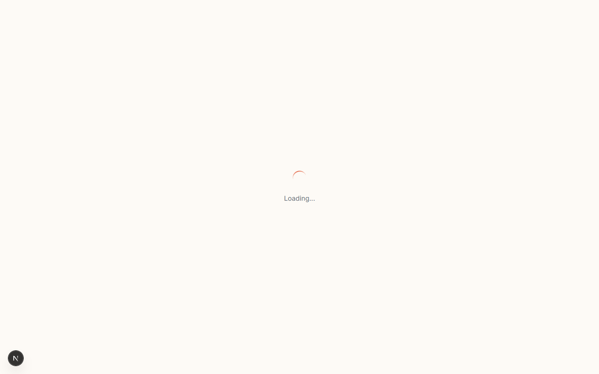

- **Rota:** `/login`
- **Descrição:** Ponto de entrada protegido do painel de administração. Suporta autenticação por senha local mestre ou SSO corporativo (OIDC / SAML 2.0).
- **Instruções de Uso:**
  1. Digite a senha administrativa (padrão local: `123456` ou o valor configurado em `INITIAL_PASSWORD` no `.env`).
  2. Clique em **Login**. O sistema armazena um cookie de sessão seguro (`auth_token`) com validade automática.

---

## 2. Endpoint & Chaves de API

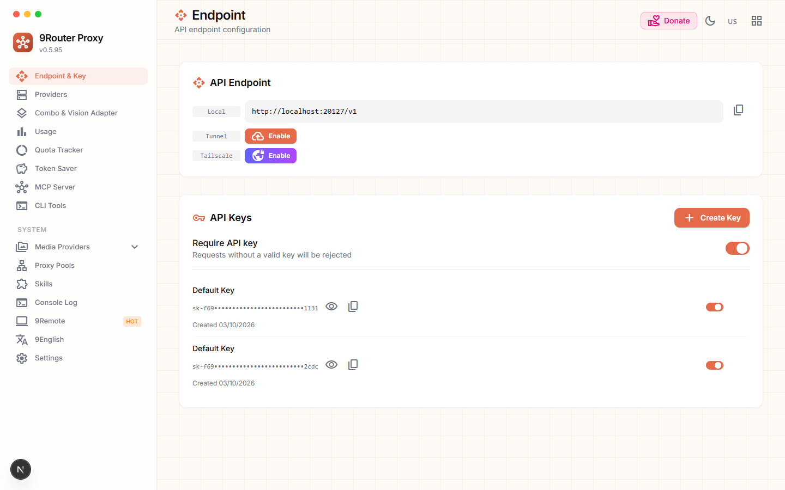

- **Rota:** `/dashboard/endpoint`
- **Descrição:** Painel principal com os endereços de conexão do gateway e gerenciamento de chaves de acesso para clientes.
- **Recursos Principais:**
  - **Endpoint da API:** Exibe a URL base (ex.: `http://localhost:20127/v1` ou via túnel remoto).
  - **Túnel & Tailscale:** Botões para expor o servidor local de forma segura na internet via Cloudflare Tunnel ou Tailscale.
  - **Chaves de API:** Chave padrão (`Default Key`), toggle para exigir autenticação obrigatória (`Require API Key`) e botão para gerar novas credenciais seguras.

---

## 3. Gerenciamento de Provedores (Providers)

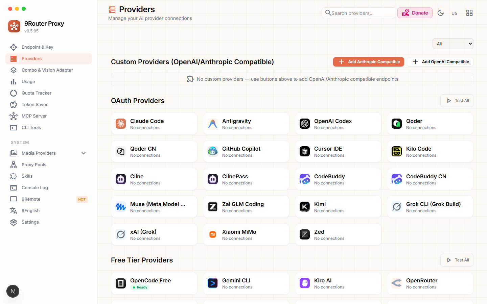

- **Rota:** `/dashboard/providers`
- **Descrição:** Catálogo e gerenciador de conexões com provedores upstream (Claude, OpenAI, Codex, Antigravity, Gemini, DeepSeek, Ollama, etc.).
- **Recursos Principais:**
  - Suporte a autenticação via OAuth/Session (com auto-refresh de token) ou API Keys tradicionais.
  - Associação de contas com **Proxy Pools** individuais para contornar restrições geográficas ou rate limits.
  - Botão **+ Add Provider** para conectar novos nós compatíveis.

---

## 4. Combos de Modelos & Adaptador de Visão

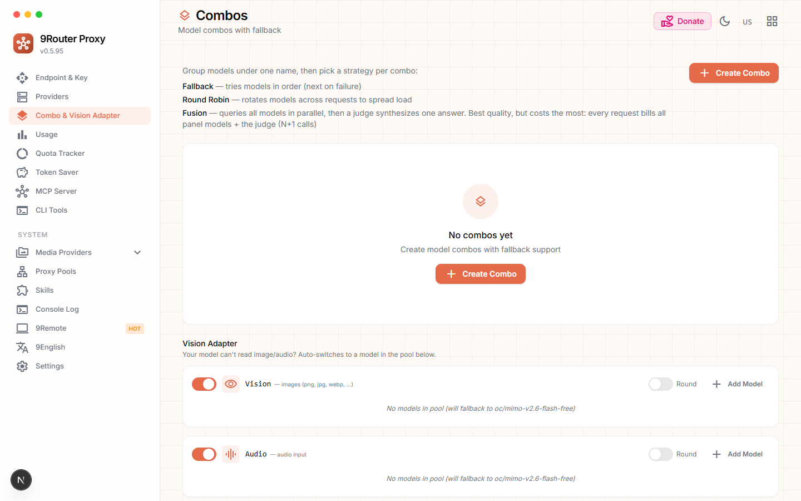

- **Rota:** `/dashboard/combos`
- **Descrição:** Criação de rotas inteligentes de failover. Permite que um único nome de modelo (ex.: `smart-fallback`) tente uma sequência ordenada de modelos e provedores caso o primário retorne erro ou limite de cota.
- **Recursos Principais:**
  - **Cadeias de Prioridade:** Arraste e solte (drag-and-drop) os modelos para definir a ordem de tentativa.
  - **Adaptador de Visão:** Fallback automático para modelos com capacidade visual quando a mensagem original contiver imagens.

---

## 5. Estatísticas de Consumo (Usage)

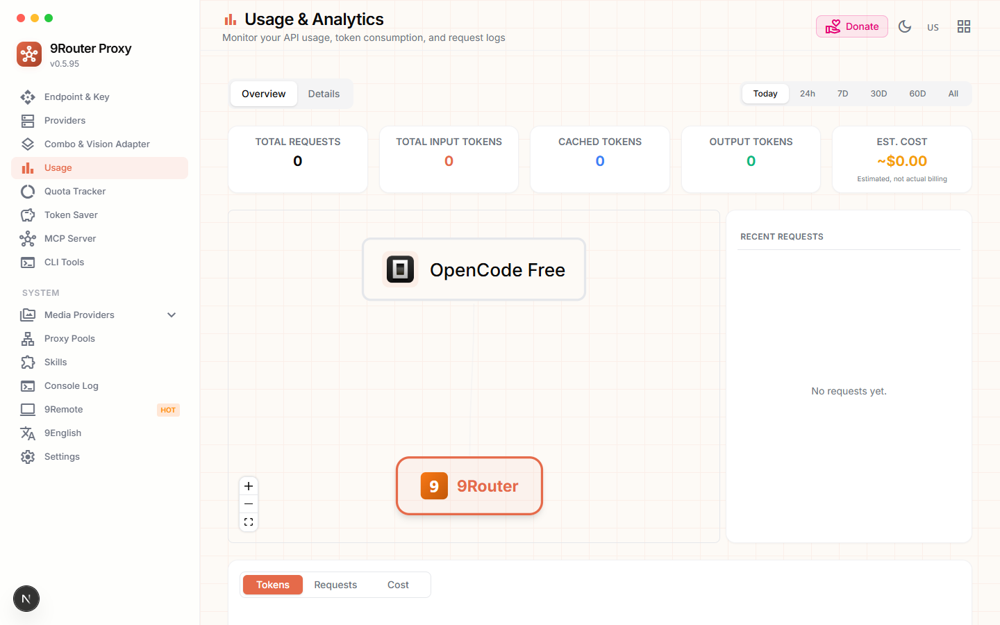

- **Rota:** `/dashboard/usage`
- **Descrição:** Painel de observabilidade com gráficos e métricas consolidadas sobre tokens consumidos, custos estimados e requisições.
- **Filtros e Visualização:**
  - Filtro temporal: 24h, 7d, 30d, 60d ou Todo o período (*All Time*).
  - Decomposição por Provedor, Modelo e Chave de API cliente.
  - Aba de **Request Details** para inspecionar payloads e latência de chamadas individuais.

---

## 6. Rastreador de Cotas (Quota Tracker)

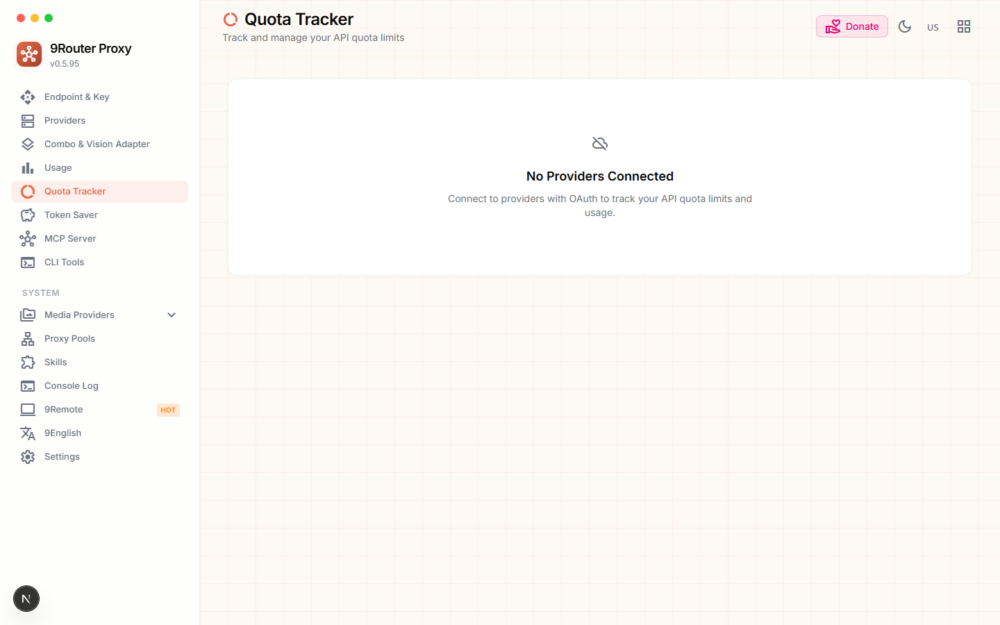

- **Rota:** `/dashboard/quota`
- **Descrição:** Monitoramento em tempo real do limite de requisições, janelas de reinicialização de cotas e créditos disponíveis nas contas de cada provedor (ex.: janelas semanais de Claude, cotas diárias de Gemini, saldos do DeepSeek).

---

## 7. Economizador de Tokens (Token Saver / RTK)

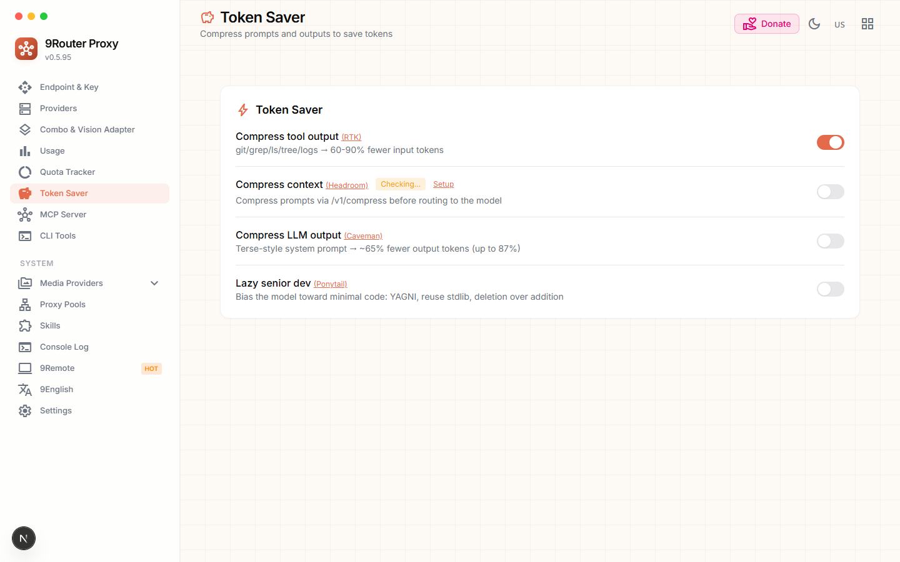

- **Rota:** `/dashboard/token-saver`
- **Descrição:** Mecanismo avançado de compressão em memória de payloads LLM para economia de contexto.
- **Tecnologias Integradas:**
  - **RTK (Request Token Killer):** Compacta saídas de ferramentas (`tool_result`) mantendo erros e stack traces intactos (*fail-open*).
  - **Headroom Proxy:** Otimização e deduplicação de contexto.
  - **Caveman Mode:** Modo de sistema ultra-compacto que economiza até 75% dos tokens sem perda de precisão técnica.

---

## 8. Servidor MCP Nativo (Model Context Protocol)

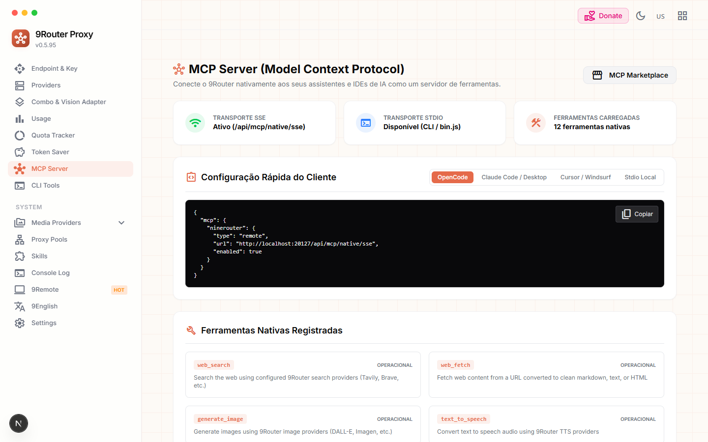

- **Rota:** `/dashboard/mcp`
- **Descrição:** Central de gerenciamento do servidor MCP integrado ao 9Router.
- **Destaques:**
  - **Transporte Duplo:** Monitoramento dos canais **SSE** (`/api/mcp/native/sse`) e **Stdio** (`src/mcp/bin.js`).
  - **Snippets de 1 Clique:** Configurações prontas para copiar e colar no **OpenCode**, **Claude Code**, **Cursor/Windsurf** e **Claude Desktop**.
  - **12 Ferramentas Registradas:** Busca web (`web_search`, `web_fetch`), mídia (`generate_image`, `text_to_speech`, `speech_to_text`), `embeddings`, `list_models` e ferramentas de administração do gateway (`9router_status`, `9router_list_combos`, etc.).
  - Acesso direto ao **MCP Marketplace** oficial da Anthropic.

---

## 9. Ferramentas CLI & IDEs

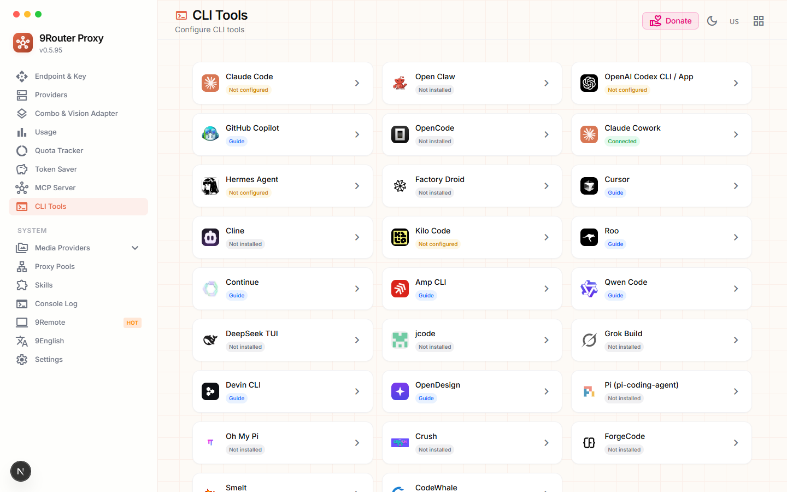

- **Rota:** `/dashboard/cli-tools`
- **Descrição:** Conectores automatizados para configurar o 9Router como backend de IA das ferramentas mais populares do ecossistema de desenvolvimento:
  - Claude Code, OpenCode, Codex CLI, Cursor, Cline, Roo, GitHub Copilot, Factory Droid e Hermes Agent.
  - Injeção de proxies MITM locais para ferramentas proprietárias como Antigravity e Kiro.

---

## 10. Pools de Proxy & Integração Webshare

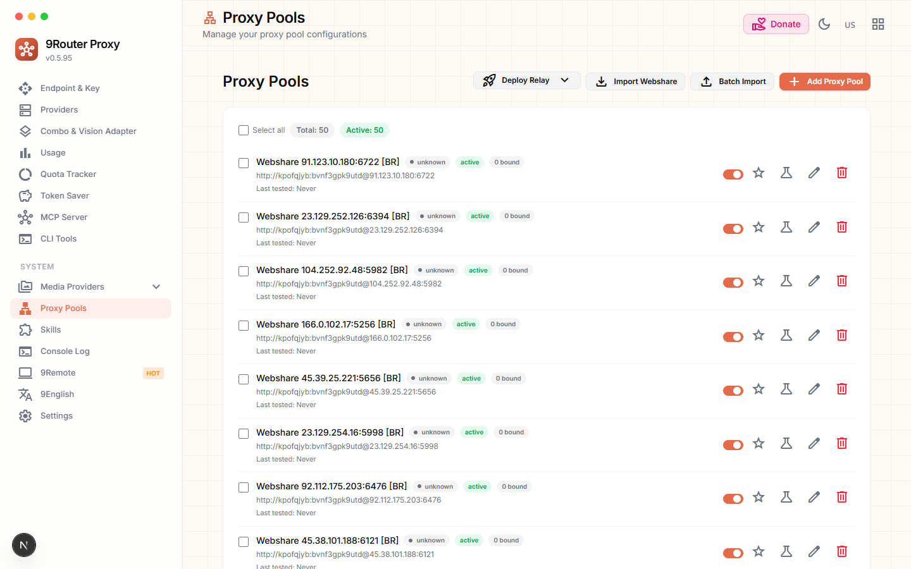

- **Rota:** `/dashboard/proxy-pools`
- **Descrição:** Gerenciador completo de redes de proxy e relays.
- **Novidades Implementadas:**
  - **Importação Direta Webshare:** Puxa proxies atribuídos via API Key do Webshare com país e cidade formatados.
  - **Auto-Cura e Substituição de IPs Mortos (`Sync & Auto-Replace`):** Detecta proxies fora do ar, solicita novos IPs via `/api/v3/proxy/replace/` na API do Webshare e atualiza o banco do 9Router automaticamente.
  - **Proxy Padrão Global (Ícone ⭐):** Permite eleger um proxy padrão que será assumido por todas as chamadas do 9Router quando nenhum proxy específico estiver associado à conta.

---

## 11. Provedores de Mídia e Busca Web

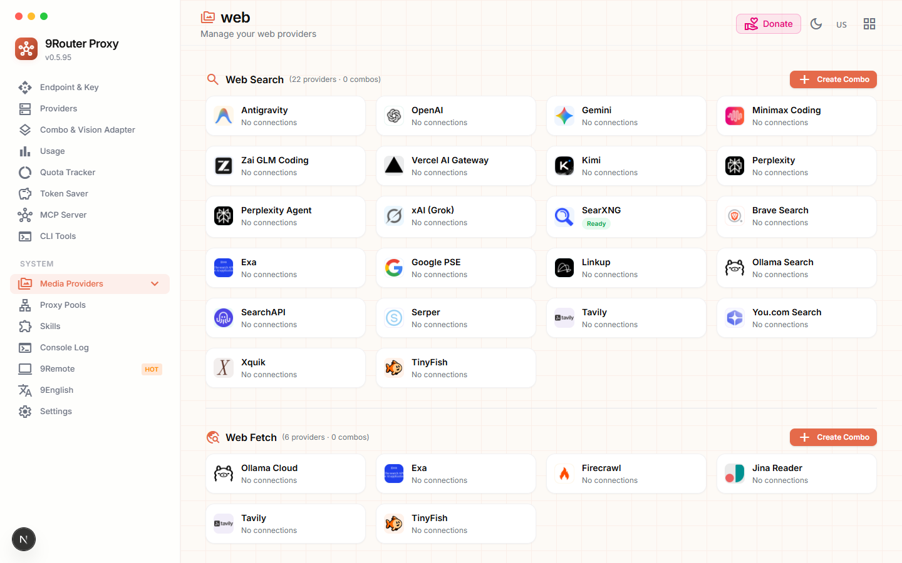

- **Rota:** `/dashboard/media-providers/web` (e abas de Imagem, Áudio e Vídeo)
- **Descrição:** Configuração de endpoints especializados em multimodalidade:
  - Mecanismos de busca e raspagem web (Tavily, Brave, Jina Reader, Firecrawl).
  - Geração de imagens (DALL-E, Stability AI, Fal.ai, ComfyUI).
  - Voz e transcrição (ElevenLabs, Edge TTS, Whisper).

---

## 12. Habilidades (Skills)

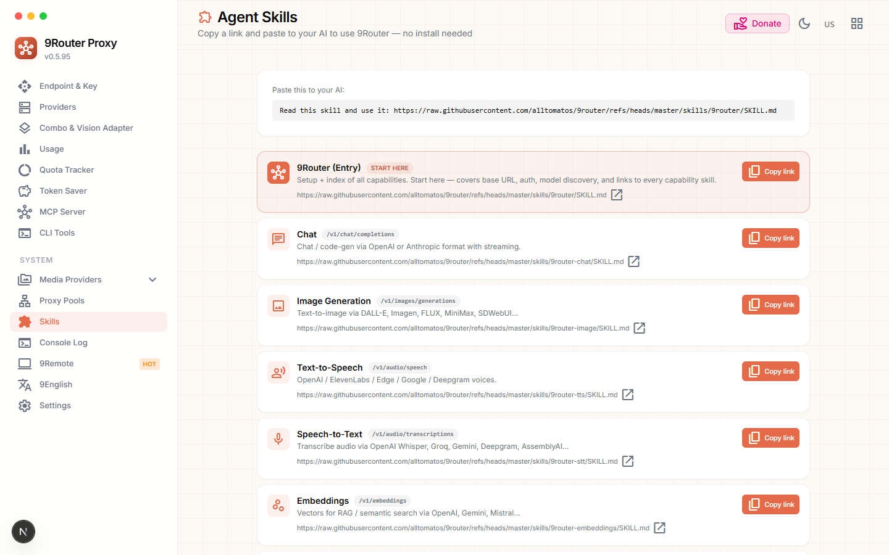

- **Rota:** `/dashboard/skills`
- **Descrição:** Catálogo e sincronizador de habilidades de engenharia e automação disponíveis para agentes inteligentes que consom o 9Router.

---

## 13. Log do Console & Diagnóstico

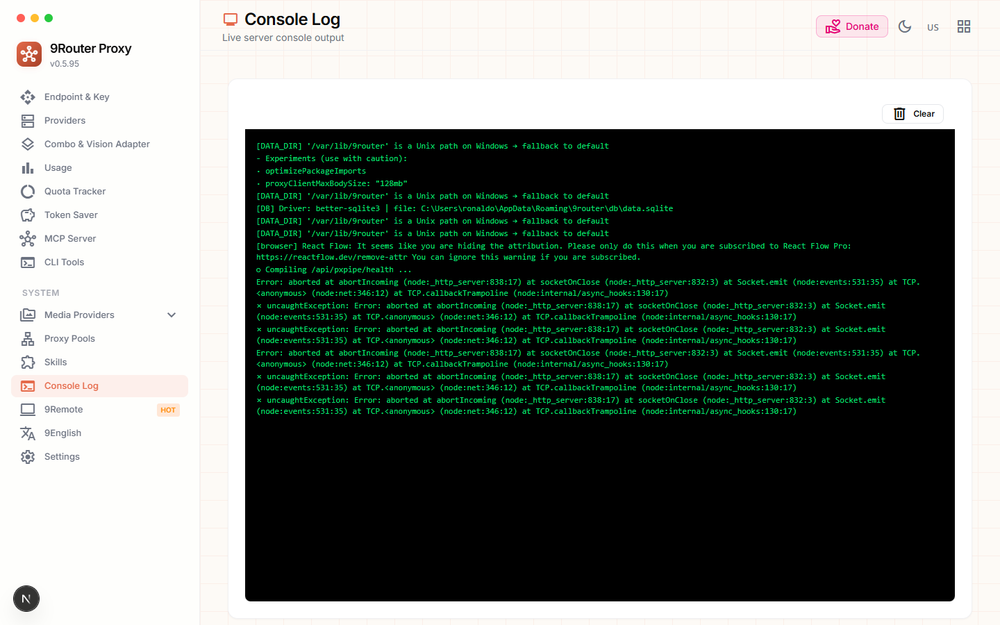

- **Rota:** `/dashboard/console-log`
- **Descrição:** Buffer em tempo real de logs de execução do servidor, erros de rede, rotação de contas e status de conexões SSE.

---

## 14. Configurações Globais (Settings)

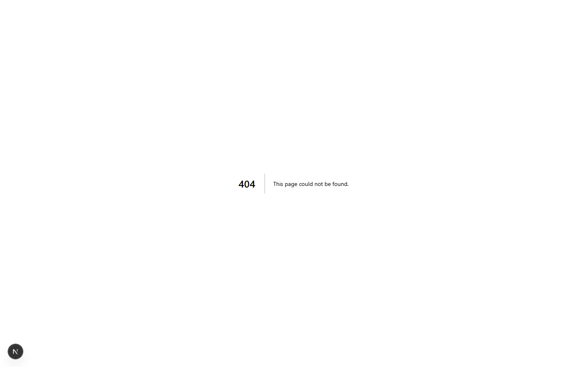

- **Rota:** `/dashboard/settings`
- **Descrição:** Ajustes administrativos do servidor:
  - Alteração de senha mestre.
  - Configuração de autenticação corporativa (OIDC / SAML).
  - Backup e restauração do banco SQLite (`data.sqlite`).
  - Habilitação de proxies outbound e limites de taxa globais.
